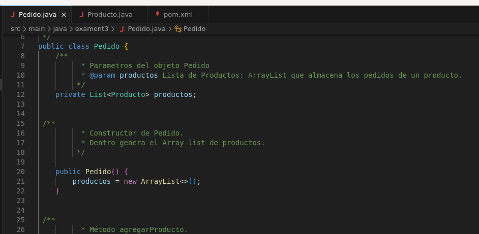
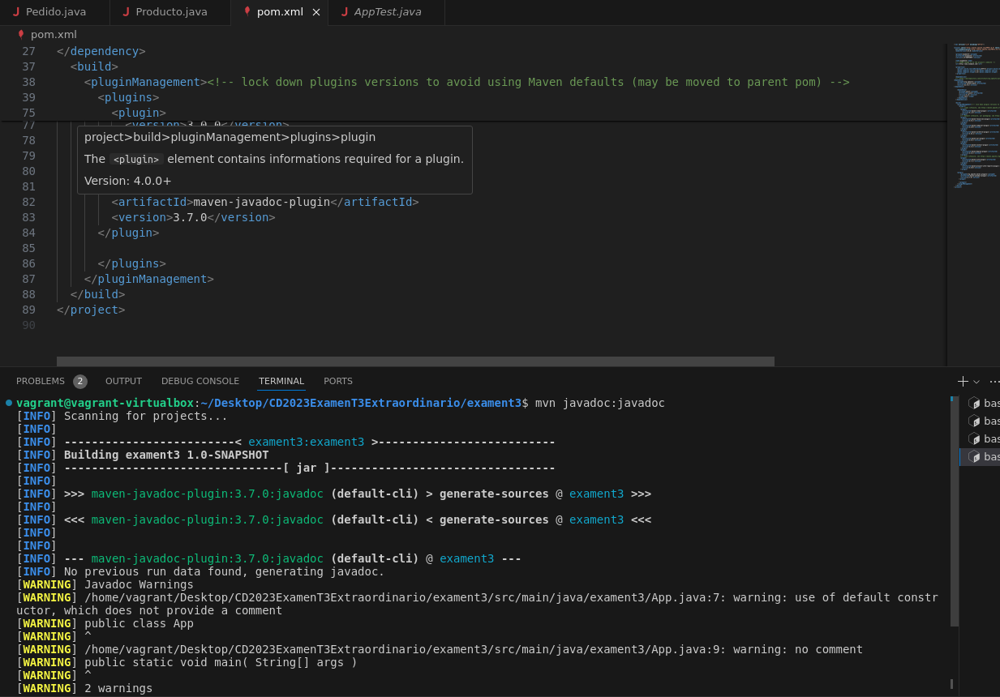
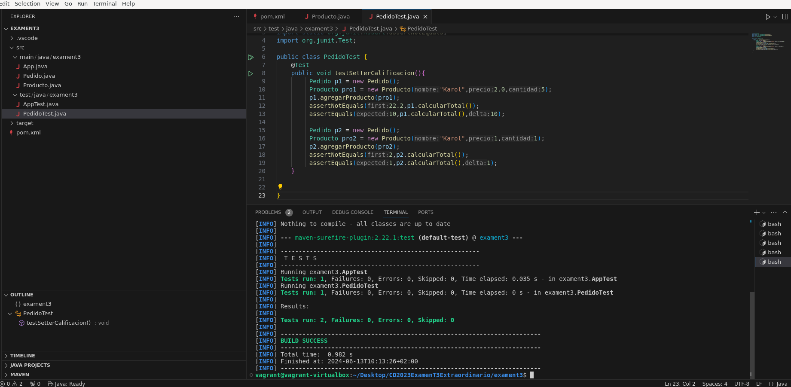
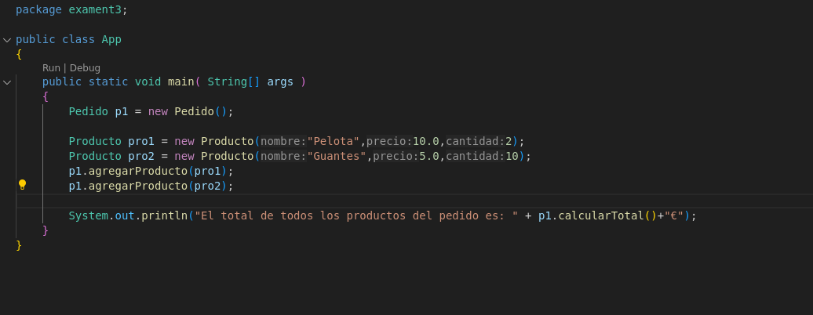
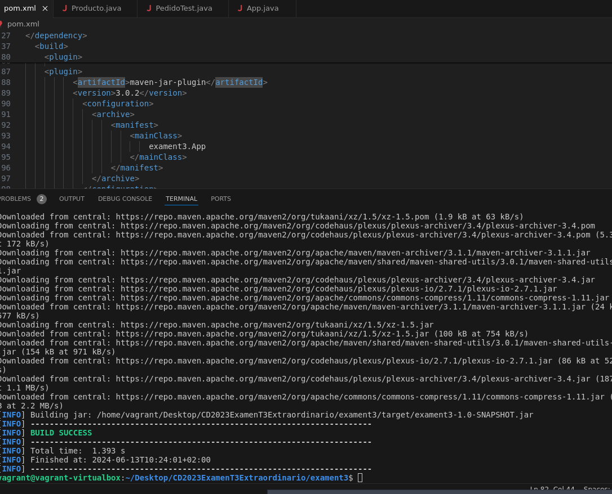
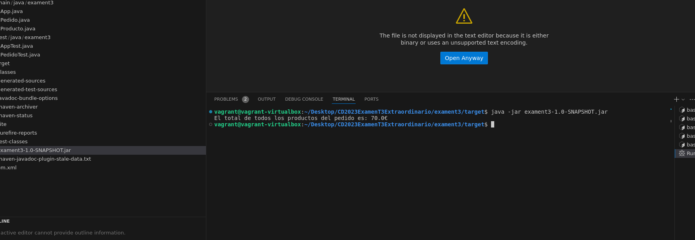

# EXAMEN T3 - Marcos Fdez

## EJERCICIO 1 - Documentación

### Pasamos los .java a la carpeta generada por el mvn /src/main/java/exament3
### Comentamos los .java para generar los javadoc:

### Generamos la documentación javadoc poniendo el plugin de javadoc en el pom.xml y con el comando mvn javadoc:javadoc

## Ejercicio 2 - Pruebas

Creo el archivo PedidosTest y realizo un par de pruebas basicas dentro de el para comprobar que el método CalcularTotal()

## Ejercicio 3 - Creación de App y empaquetar

### Creamos el App.java:

### Tendremos que poner el plugin para generar el .jar en el pom.xml y generamos el jar con mvn jar:jar 

### Ejecutamos el jar:

